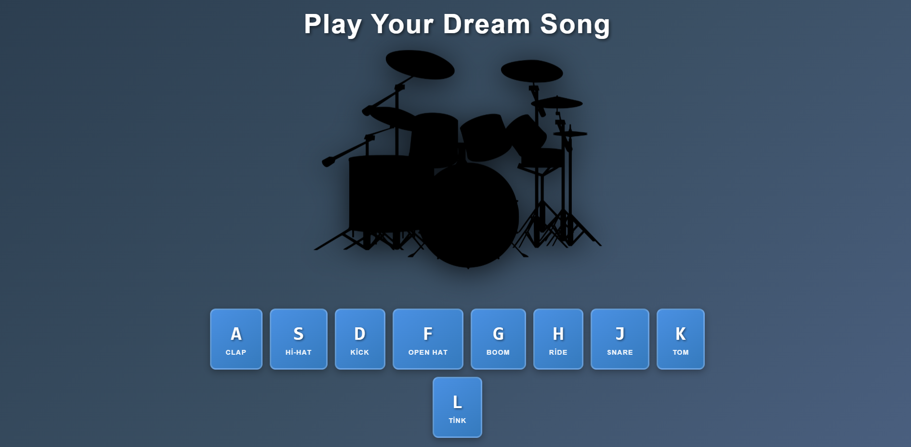

# JavaScript Drum Kit 🥁

İnteraktif ve eğlenceli bir web tabanlı davul seti uygulaması. Klavyenizi kullanarak veya ekrandaki düğmelere tıklayarak müzik yapabilirsiniz!

## 🎵 Canlı Demo

[Projeyi Görüntüle](https://mhmtfthunal.github.io/JavascriptDrumKit)

> **Not:** GitHub Pages'i aktifleştirmek için:
> 1. Repository ayarlarına gidin (Settings)
> 2. Sol menüden "Pages" seçeneğini seçin
> 3. "Source" altında "Deploy from a branch" seçin
> 4. "Branch" olarak "main" veya "master" seçin ve kaydedin
> 5. Birkaç dakika bekleyin, siteniz yayınlanacak!

## 📸 Ekran Görüntüsü



## 🎮 Özellikler

- ✨ 9 farklı davul sesi (Clap, Hi-Hat, Kick, Open Hat, Boom, Ride, Snare, Tom, Tink)
- ⌨️ Klavye desteği (A, S, D, F, G, H, J, K, L tuşları)
- 🖱️ Tıklama desteği (Düğmelere doğrudan tıklayabilirsiniz)
- 📱 Mobil uyumlu (Touch desteği)
- 🎨 Modern ve şık tasarım
- 💫 Her tuş için özel animasyonlar:
  - **A (Clap)**: Pulse animasyonu
  - **S (Hi-Hat)**: Shake animasyonu
  - **D (Kick)**: Bounce animasyonu
  - **F (Open Hat)**: Rotate animasyonu
  - **G (Boom)**: Pulse + Glow animasyonu
  - **H (Ride)**: Shake animasyonu
  - **J (Snare)**: Bounce animasyonu
  - **K (Tom)**: Rotate animasyonu
  - **L (Tink)**: Hızlı Pulse animasyonu
- ✨ Parıltı efektleri (Bonus görsel efekt)
- 🎯 Responsive tasarım (Tüm cihazlarda çalışır)

## 🚀 Kullanım

1. Web sayfasını açın
2. Klavyenizdeki **A, S, D, F, G, H, J, K, L** tuşlarına basın
3. Veya ekrandaki düğmelere tıklayın
4. Ritim tutun ve eğlenin! 🎉

## 🛠️ Teknolojiler

- **HTML5**: Yapı ve ses elementleri
- **CSS3**: Modern tasarım ve animasyonlar
- **JavaScript (Vanilla)**: İnteraktif özellikler ve ses kontrolü

## 📂 Proje Yapısı

```
JavascriptDrumKit/
│
├── index.html          # Ana HTML dosyası
├── style.css           # Stil dosyası
├── script.js           # JavaScript dosyası
├── README.md           # Proje dokümantasyonu
├── drum.png            # Davul görseli
│
└── Ses Dosyaları:
    ├── clap.wav
    ├── hihat.wav
    ├── kick.wav
    ├── openhat.wav
    ├── boom.wav
    ├── ride.wav
    ├── snare.wav
    ├── tom.wav
    └── tink.wav
```

## 🎹 Tuş Haritası

| Tuş | Ses | Animasyon |
|-----|-----|-----------|
| A | Clap | Pulse |
| S | Hi-Hat | Shake |
| D | Kick | Bounce |
| F | Open Hat | Rotate |
| G | Boom | Pulse + Glow |
| H | Ride | Shake |
| J | Snare | Bounce |
| K | Tom | Rotate |
| L | Tink | Quick Pulse |

## 💡 Öğrenilen Konular

Bu proje ile aşağıdaki konuları öğrenebilirsiniz:

- HTML `<audio>` elementi kullanımı
- CSS animasyonları ve transitions
- JavaScript event listeners (keyboard ve click)
- DOM manipülasyonu
- Data attributes kullanımı
- Responsive web tasarım
- CSS gradient ve box-shadow efektleri

## 🎨 Özelleştirme

### Ses Dosyalarını Değiştirme

`index.html` dosyasında ilgili `<audio>` elementinin `src` özelliğini değiştirin:

```html
<audio data-key="65" src="yeni-ses.wav"></audio>
```

### Animasyonları Özelleştirme

`style.css` dosyasında ilgili keyframe animasyonlarını düzenleyin veya yeni animasyonlar ekleyin.

### Tuş Atamaları Değiştirme

`index.html` ve `script.js` dosyalarındaki `data-key` değerlerini değiştirin. 
([Klavye Key Kodları](https://keycode.info/) sayfasından kod bulabilirsiniz)

## 📝 Lisans

Bu proje eğitim amaçlı oluşturulmuştur ve serbestçe kullanılabilir.

## 🤝 Katkıda Bulunma

Katkılarınızı bekliyoruz! Pull request göndermekten çekinmeyin.

## 📧 İletişim

Sorularınız için issue açabilir veya benimle iletişime geçebilirsiniz.

---

⭐ Projeyi beğendiyseniz yıldız vermeyi unutmayın!

**Keyifli kodlamalar!** 🎵🥁

